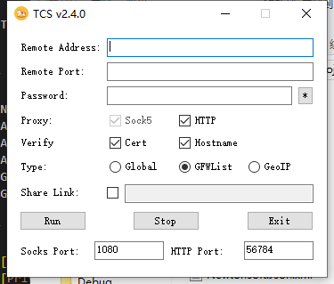

# TCS

A slim cilent for Trojan-GFW.

## What's TCS?

TCS(Trojan Client Slim) is a slim and easy client for Trojan-GFW. 

> TIPS: TCS only gives the most basic functions. If you need full-feature experience, please configure Trojan-GFW manually.

## What's supported?

- Now TCS support share link.
- Auto configure HTTP proxy.
- Auto save config.
- Auto generate trojan conf. (TLS1.3, H2, etc.)
- GfWList mode to bypass GFW.
- GeoIP mode.

## Components

- [Trojan-GFW](https://github.com/trojan-gfw/trojan) **(1.14.1)** **GPLv3**
- [Privoxy](https://www.privoxy.org/) **(3.0.28.0)** **GPLv2**
- [Clash](https://github.com/Dreamacro/clash) **(0.18.0)** **GPLv3**
- [TCS](https://github.com/KevinZonda/trojan-client-slim) **(2.4.0)** **GPLv3**

## TODO

- Node list

## Screenshot(s)

## One more thing

Welcome to use Telegram to communicate with us. Our group link is https://t.me/ohtcs
