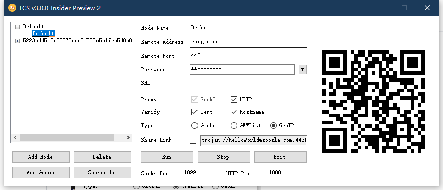

# TCS

A slim cilent for Trojan-GFW.

## What's TCS?

TCS(Trojan Client Slim) is a slim and easy client for Trojan-GFW.

> TIPS: TCS only gives the most basic functions. If you need full-feature experience, please configure Trojan-GFW manually.

## What's supported?

- Share link
- Auto configure HTTP proxy
- Auto save config
- Auto generate trojan conf
- GfWList mode to bypass GFW
- GeoIP mode(Depends on Clash)
- Node list *(Supported in 3.0.0)*
- SNI settings *(Supported in 3.0.0)*

## TODO

- Subscription auto update
- Subscription list

## Screenshot(s)

### TCS 2.4.0


### TCS 3.0.0 Preview 2



## Chat

Welcome to use Telegram to communicate with us. Our group link is <https://t.me/ohtcs>

## Credit

- [Trojan-GFW](https://github.com/trojan-gfw/trojan)

```credit
Version: 1.14.1
License: GPLv3
```

- [Privoxy](https://www.privoxy.org/)

```credit
Version: 3.0.28.0
License: GPLv2
```

- [Clash](https://github.com/Dreamacro/clash)

```credit
Version: 0.18.0
License: GPLv3
```

## Open-Sourced License - [GNU General Public License v3.0](LICENSE)

```license
                    GNU GENERAL PUBLIC LICENSE
                       Version 3, 29 June 2007

 Copyright (C) 2007 Free Software Foundation, Inc. <https://fsf.org/>
 Everyone is permitted to copy and distribute verbatim copies
 of this license document, but changing it is not allowed.
```
